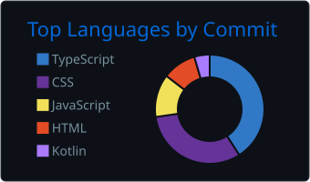

<h1 align="center">Valdiclei Filho</h1>

<h3 align="center">Desenvolvedor de Integrações</h3>

<p align="center">
  Node.js • AWS Lambda • APIs • SQL • JasperReports<br>
  ERPs & CRMs • Análise & Especificação Técnica
</p>

<div align="center">
  <a href="https://www.linkedin.com/in/valdiclei-filho/">
    
  </a>
  <a href="https://github.com/Valdiclei-Filho">
    
  </a>
</div>

<br>

<div align="center">
  
</div>

## Sobre mim

Atuo no desenvolvimento, manutenção e evolução de integrações entre sistemas corporativos, ERPs, CRMs, APIs e serviços de terceiros.

Minha atuação abrange desenvolvimento backend, análise funcional e técnica, banco de dados, observabilidade, troubleshooting de ambientes produtivos, homologação e documentação de soluções.

Trabalho principalmente com **Node.js, AWS Lambda, APIs REST/SOAP, SQL/MySQL e JasperReports**, além da integração com diferentes ERPs e plataformas corporativas.

<br>

## Stack

<div align="center">


<br>


<br>


</div>

<br>

## Atuação técnica

```text
Integração de Sistemas
│
├── Backend & Cloud
│   ├── Node.js / JavaScript / TypeScript
│   └── AWS Lambda
│
├── APIs & Comunicação
│   ├── REST / SOAP
│   ├── Webhooks / SFTP
│   └── JSON / XML
│
├── Dados & Relatórios
│   ├── SQL / MySQL / Views
│   └── JasperReports / JRXML
│
├── Observabilidade
│   ├── AWS CloudWatch
│   └── Dynatrace
│
└── Engenharia de Integração
    ├── Troubleshooting
    ├── Análise Funcional
    ├── Especificação Técnica
    ├── Documentação Técnica
    └── Homologação
```

### Ecossistemas

**ERPs:** `SAP S/4HANA` • `SAP B1` • `Protheus` • `Senior` • `Sankhya` • `Omie`

**CRM:** `HubSpot`

<br>

## Projetos & Experiência Técnica

<div align="center">
  
</div>

### Projetos públicos

<div align="center">
  <a href="https://github.com/Valdiclei-Filho/IntegrationCSV_TXT"><b>IntegrationCSV_TXT</b></a>
  &nbsp;•&nbsp;
  <a href="https://github.com/Valdiclei-Filho/Gestao_Viagem"><b>Gestao_Viagem</b></a>
  &nbsp;•&nbsp;
  <a href="https://github.com/Valdiclei-Filho/Book_Control"><b>Book_Control</b></a>
  <br>
  <a href="https://github.com/Valdiclei-Filho/park-ease"><b>park-ease</b></a>
  &nbsp;•&nbsp;
  <a href="https://github.com/Valdiclei-Filho/Banana_MQTT"><b>Banana_MQTT</b></a>
  &nbsp;•&nbsp;
  <a href="https://github.com/Valdiclei-Filho/SocialMedia"><b>SocialMedia</b></a>
</div>

<p align="center">
  Além dos projetos públicos, mantenho atividade em projetos privados, apresentada apenas por métricas agregadas.
</p>

<br>

## Atividade GitHub

<div align="center">
  <picture>
    <source media="(prefers-color-scheme: dark)" srcset="https://raw.githubusercontent.com/Valdiclei-Filho/Valdiclei-Filho/output/github-contribution-grid-snake-dark.svg" />
    <source media="(prefers-color-scheme: light)" srcset="https://raw.githubusercontent.com/Valdiclei-Filho/Valdiclei-Filho/output/github-contribution-grid-snake.svg" />
    
  </picture>
</div>

<br>

## Resumo de contribuições

<div align="center">

  

  <br><br>

  
  

  <br><br>

  
  

  <br><br>

  

</div>
